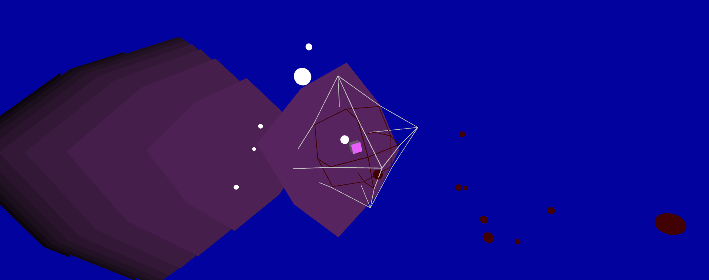
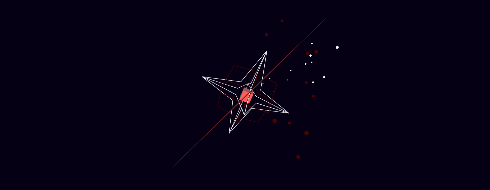

# SLEEP PARALYSIS | PART 2: GRAPHICS

## Idea

The idea was to create a graphic that visually supports the already created audio project about sleep paralysis. The graphic project should represent the state between sleep and being awake. Since one cannot move during sleep paralysis, the "being trapped in one's own body" should also be visually represented. To achieve an intense effect, the goal was to link the graphic project and the audio project. 

## Artistic Intention

The protagonist of the rather abstract scenery is a small cube, which finds its place in the center of the composition. This cube represents the (sleeping) human being. The cube is always in the center of the picture and is therefore clearly identified as the protagonist. Around the cube are two geometric shapes, which consist exclusively of contours. These shapes are meant to appear as cages that hold the cube captive. They symbolize, on the one hand, the cage of the body, which cannot be moved during a sleep paralysis, and, on the other hand, the mind, which can also cause a feeling of constriction and paranoia through threatening thoughts. These three elements move appropriately to different frequencies of the piece of music. The cube and one of the cages (that of the mind) move appropriately to the low frequencies. These two elements move in the same rhythm to make the common - though still fighting - attempt to rebel against the body. A pulsating effect is created, which is supposed to give rise to a "breaking out" feeling. The antagonist in this game is represented by the outer cage (that of the body). This tends to move to higher frequencies and pulsating inward, so that the cages sometimes overlap. In these moments, it almost seems as if the protagonist is about to wake up and overcome sleep paralysis. 

Behind these three main elements there is - at first glance - a coherent surface. When moving in three-dimensional space (user interaction), it can be seen that there are several independent surfaces, one behind the other. These surfaces move partly in such a way that they get in front of the cube and into the cages and thus seem to "swallow" the cube. They represent the dream world. It is an oppressive force that wants to drag people back to sleep and has multiple dream levels. At first glance it appears one-dimensional, but closer inspection reveals depths. In addition, the planes are "distorted" by mouse interactions. This effect is meant to refer to the illogical aspects of dreams that often distort reality. The last element of the composition are spheres, which also circle around the cube. They lie outside the cages and are meant to represent reality in a waking state. They are the only round elements of the image and thus are meant to create a soft positive and free effects. 

## Technical choices

For the graphic project, the technical means of the course were used. The sound was integrated into the set-up using the p5-Sound library and with the help of the p5.FFT function, different frequency ranges could be stored in variables. Thus, a kind of live performance to the music could be created within the graphics. 

The shader functions obtained in class were applied to the cube. Overall, use was made of WEBGL and different lights and materials were added to the scene.  The shapes were created using vertex points and the beginShape and endShape functions.

The user can interact with the graphics by using the mouse (mouseX and mouseY): The colors of the lights and background and the position of the spheres change to match the position of the mouse. He can also change the color abruptly with a left click and move within the scene thanks to the orbitControl function. The dream world shapes are distorted by the mouse behavior, which is possible with the help of a matrix transformation. 

## Learnings

Through the graphics project I was able to acquire a lot of new knowledge about integrating sound into a p5 sketch. It also allowed me to practice the function behind matrices and the possibilities of three-dimensionality in p5 sketches. Overall, it was a good exercise to become more familiar with the p5-library. 

