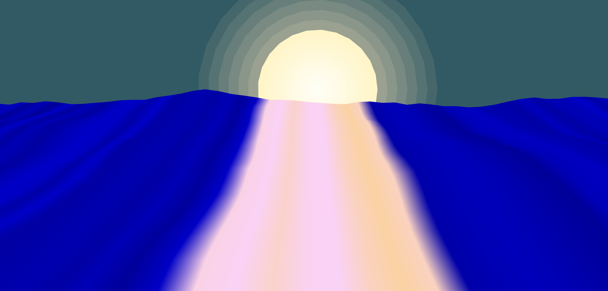
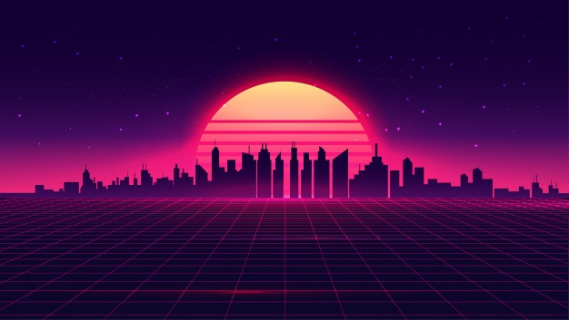

# Waves

## Idea

My main idea was to create a RetroWave/Synthwave scene with Three.js using different shaders and post-processing. I implemented different RenderPasses and wrote a small shader file for creating a Gridplane but unfortunately i had many difficulties making the shaders work and also didn't find much information online how to implement external shader files into a Three.js scene.

After many unsuccessfull tries I decided to switch back to p5.js and create a new scene. I started with a Terrain-Grid which i created by looping through vertices with a for() function for rows and columns. I then added some noise on each vertex creating the wave effect. In addition I created an Array with different blue colors which fill the grid making it appear as water. Afterwards I added a sun which was also created with a for() function drawing many ellipses on the same spot with growing sizes and lerping through 2 color schemes. Finally I select a column range on the Terrain Grid and changed the color to a yellow color which represents the suns reflection. 

## Challenges and Learnings

As mentioned before I would really like to know how to implement shaders as external files in Three.js and I will keep trying to create the RetrowaveScene which was my main idea for this project. I am also very interest in the post-processing options you have in Three.js but it is very difficult for me to get my head around it. I also would like to improve my skills with shaders because I noticed that I still have some difficulties creating them. 

I learend a lot of new things about Three.js and got more fluent in it aswell as in p5.js. I especially learned much about post-processing and the different RenderPasses it offers and how to create different effects. I learned how to create terrains in p5.js and how to animate them. I still have some issues with p5.js mainly how to organize my structure and how to create certain shapes. 