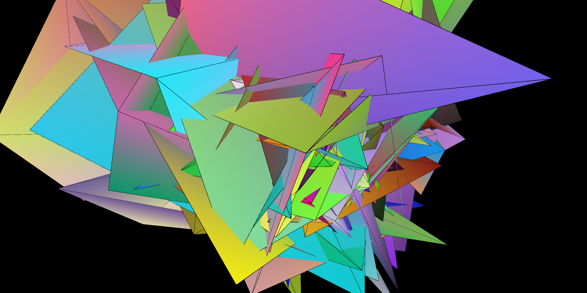
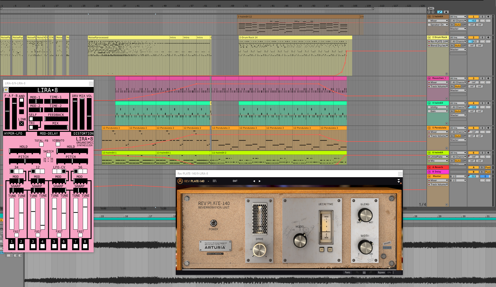
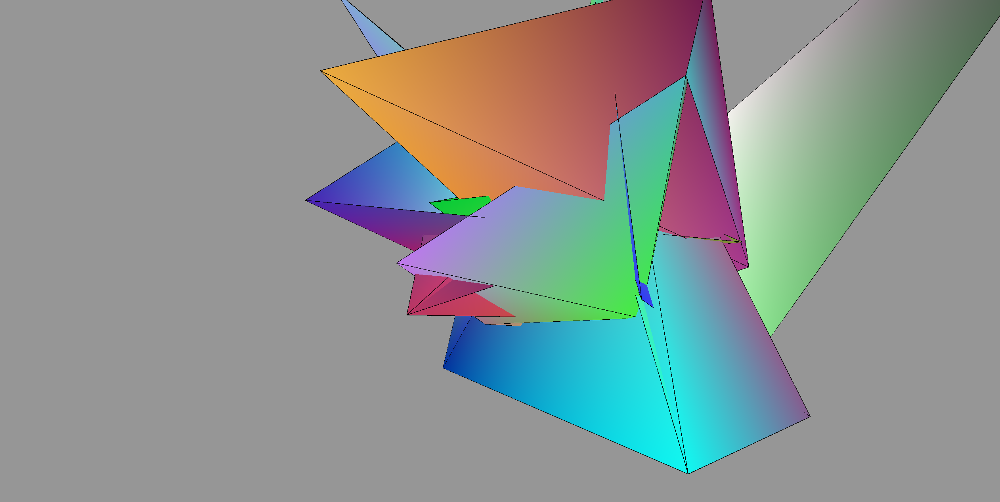

# Thoughts In Progress

## Idea
The Idea behind the project was to shed light on how I think my subjective process of thought and conceptualising is taking place. This should be represented both in a musical and also visual way. 
At the beginning there is a lot of chaos, disruption and anarchy in mind. No clear thoughts are manifesting. Small ideas rise are beeing processed, rated, compete with each other and most of the time they are  discounted. Doubt comes into play and blocks an effective developement and structuring these rising thoughts and ideas. This process of unease and unsetteledness takes place over a longer period of time and increases its weight. After some time this process gets out of hand and inside of this chaos there are small structured forms visible and they are entangling from within the chaos and start to make sense from the inner core of chaotic cloud.

## Implementation in audio
The project started in the audio section. The DAW of my choise was ableton. Conceptually I decided to at first only use sounds of my living room, because that is the place where I am at most of the time right now and where my usual thought process is done. The sounds I recorded originated from scraping along my armchair, pushing and pulling boxes from my shelf, hitting against glasses, closing and opening a scissor, books falling down and other things. These sound where then alienated by various chained effect methods in ableton and then put together into a drumrack. For interfering with these thought processes I chose a VST-synthesizer that I wanted to check out for a longer period of time: lyra 8 in combination with a VST-Reverb.

For the part when everything comes together in harmony I used the VST-Helm-synthesizer with again some reverb and a stepsequencer.

## Visual implementation 
The visual implementation was done in p5. I experimented a lot beforehand with shaders to get a hang of it and to see what I would be able to do with it. I watched some tutorials of shaderToy and worked through the first pages of the book of Shaders as well.  In the end I couldnt get it done the way I wanted to and I chose to not further try because I was way over time.
In p5 I decided to in the direction of using object oriented programming. I build a class which holds a move and a show function for displaying and then in the draw function I am building the actual object.
Also there is an array build out of the values of the FFT which is then multiplied onto every vertexpoint to make the whole thing audio reactive. There is an odd problem with the FFT in p5 which mainly is about the last values of the fft-array which do not contain any value other then "0". This is a bit strange and not very cool in the sense of usabilitym because I had to cut the array at a certain point with the for Loop, to make every vertexpoint move. Otherwise some of the vertex points would stand still. Additionally there is a check of the overall level of the audio track which is used for additional rotations of the object to give it a more disruptive look in movement.

* For opening this project one would need a local instance of the p5 library in combination with the sound-library (see the index.html)

## Learnings
* a lot about the Helm and the Lyra Synth
* ableton workflows like how to arrange / filter / distort / mangage timeline
* a lot about shaders and how to implement them in p5 besides not really beeing able to use them for this project in the end
* programming itself
* object oriented programming / functions / arrays