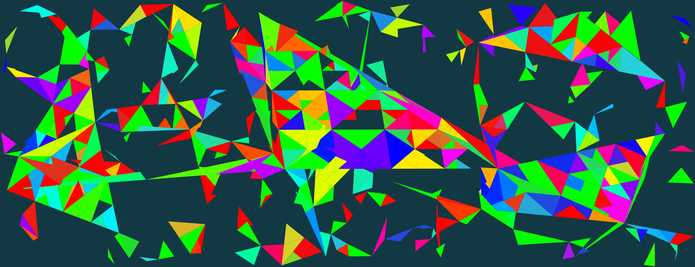
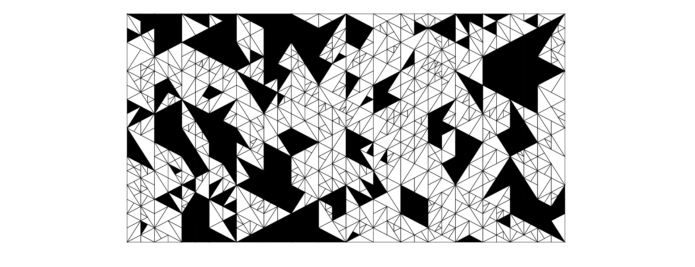

# Triangulator

## How to use

* Start a liveserver with the index file or go to [triangulator.maltehillebrand.de](http://triangulator.maltehillebrand.de).
* Start with a _"Random Triangle"_ or _"Random Square"_ by hitting the respective button.
* Use the tools _"Add Triangle"_, _"Subdivide Triangle"_ or _"Fill Triangle"_ to add, subdivide or fill triangles.
* Use the _"Autopilot"_ to automate the process.
  * Hit the checkboxes to let the autopilot use the respective tools
  * Change the probability of each tool to change their influence on the autopilots process.
  * To stop the automation select a tool again.
* Open the _"Style"_ to change the stroke width and color as well as the background color of your artpiece.

## Background

I really like the work by **Tyler Hobbs**, especially his algorithmic approach to astehtically pleasing triangle subdivison. The thing I dislike was that the entire process is more or less a blackbox of randomness with no way to interfer as an artist (who the _actual_ artist is is a different question in that regard). So I wanted to develop some sort of hybrid application with most of the features Hobbs' algorithm uses, but also the ability for the user to interfer at any time and change the outcome more to his liking.

For the implementation I used p5.js because of it's simplicity and relative ease for developing such a graphical application. The triangles are stored as objects with both their respective vector and their fill color.
When adding a triangle, a new triangle object is created, using the two closest vertices and the vertice at the new (mouse) position). When subdividing, the cross product of the longest side of the triangle is used as a new vector, in combination with the rest of the points, two new triangle objects are created. When filling a triangle, the triangle object the mouse is in, gets a new fill color set.

One big thing learning with this project was the sheer complexity something "simple" as a polygon add in common 3D programs must have as well as how all the different product of vectors are can be used to create asthetically pleasing picture with math.