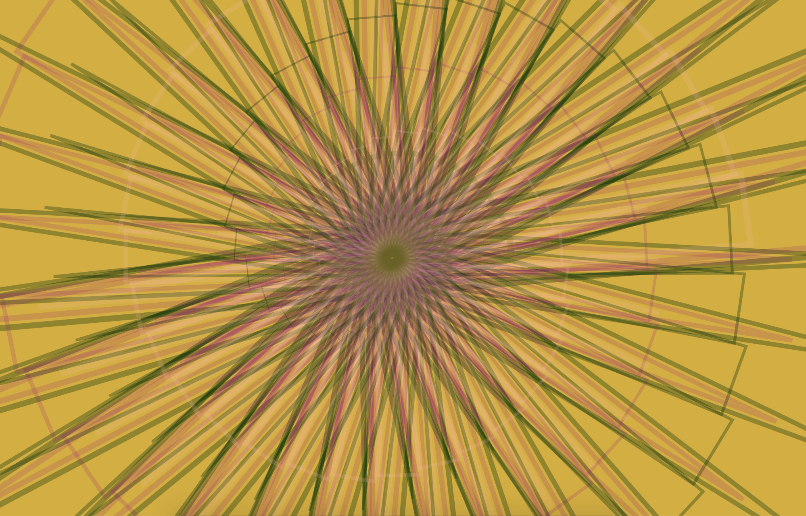

### Ula Przybylska

# SWARM

### AUDIO PROJECT:
*Swarm* is a story of a bee. 
My audio piece shows the world from the perspective of an insect troubled by human politics. 

Group of bees enjoys living and working together until it's distrupted by sounds of the protests from the outside. They need to fly out, swarm and find the better future for themselves and for the protesting humans. They want to build an utopy together.

## SUCCULENT

### GRAPHICS PROJECT

What stays the most important for the bee is collecting pollen for its community. When a bee sees its aim, it's hipnotizing. The insect recognizes its pulsating magnetic field. 

After the pollen is collected the plant is not that important anymore. It needs to be deconstructed, so it won't be a distraction. 

In my graphic projects we see through the eyes of a bee flying towards geometrical plants. I was inspired by succulents growing on my balcony. 

## A manual

--> start the sketch, get hipnotized by the succulent. After a while click the left mouse button. You will see the succulent getting rythmically deconstructed to the sound. A bit more with each click. This is when you fly away to a bew plant :)

## Technical choices, learnings and reflection

For the grafic projects I played a lot with triangle transformations and applying the matrixes. I watched a lot of tutorials and expanded my p5.js knowledge significantly. I think I now understand better how computer graphics work.

It was fun to think about making graphics a part of my audio experience. This is an approach I have never undertaken before (I was always focust on graphics first, treating sounds as background), but it worked very well for me. I am going to translate this experience to my orientation project, where I also decided to start with the sound as an indicator for the story. 

I learned a lot about sound producion as well. I always thought I am not "musical" enough to play with sound. I was wrong, it's fun. Now I also know what I am doing.