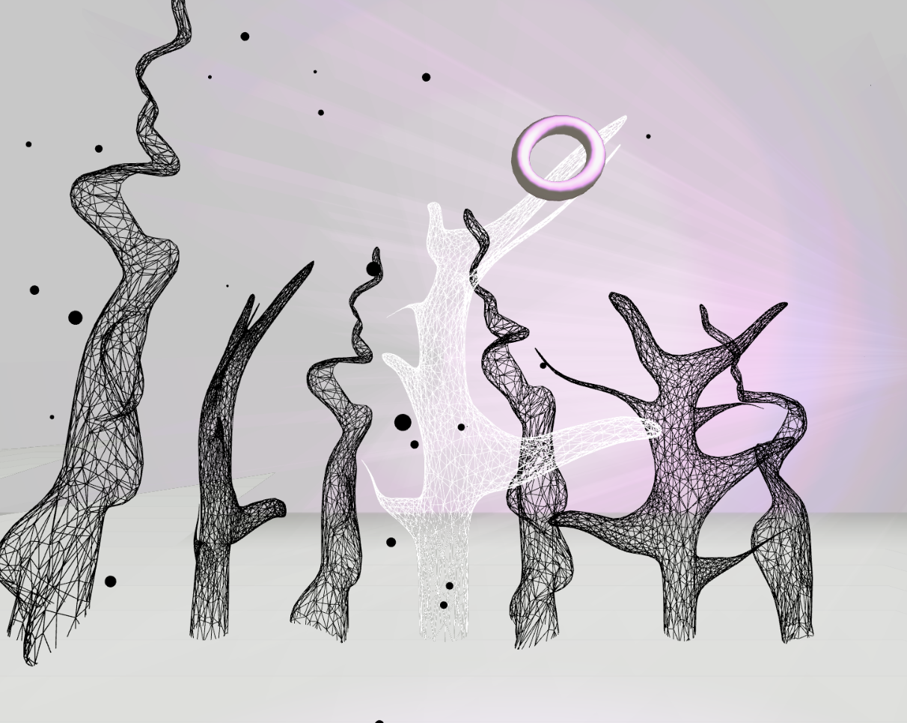

# Alien Swamp

For this graphics project I decided to create an alien world, which could accompany the audio project I have created earlier during the course. I decided to explore different ways of using sine and cosine in order and create smooth, organic movements. 

The scene represents some organic-like structures submerged in a dense fog and black rain. There is an unknown source of light, casting rays of light through the fog, wandering within the scene. 

While creating this project, I wanted to integrate techniques, which we have explored during our classes. I used p5.js as the environment. 

In order to create this project I implemented various methods of modifying and looping custom shapes, which I have found in multiple tutorials, in order to achieve wave-like movements. I also experimented with the use of Perlin noise and particle systems. Furthermore, I created simple meshes in blender and placed them within the scene.

I decided to connect the the sound amplitude to the rotation of the imported 3D models in order to create an interaction between the visual elements in the scene and the soundtrack. I also added a particle system, which is connected to the sound frequency to add an extra level of interactivity. Furthermore, I connected the movement of the mouse to the movement of the models in the scene, which turn or grow according to the mouse position.

*Learnings and Reflections:*

I feel that after creating this project I feel much more fluent in p5.js and WEBGL and have learned a multitude of different options within the library. I also learned more on how to create custom shapes and how to modify them with simple algorithms. I was working on the code in chunks and am still yet to develop a better organization when it comes to it’s cleanliness. The process I followed, was mainly one of experimentation and I still have yet to understand some concepts and techniques.