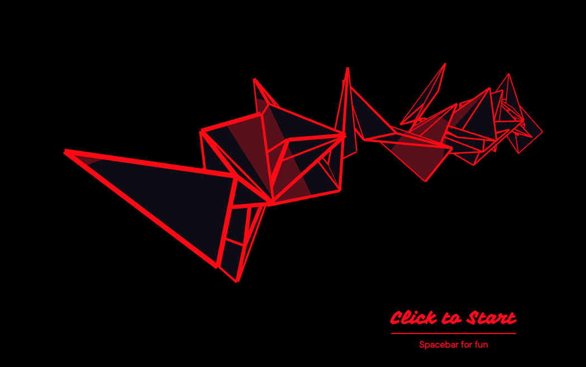

# Theoretical Backgrounds in Audio and Graphics
## Sebastian Wilhelm

## Audio Project

For the audio project I wanted to create a musical composition programmatically and used Sonic Pi.
Link to the full [documentation](https://github.com/seb-ctech/winds_of_kyoto).
Here I experimented with samples as instruments, with additive synthesis to emulate a real instrument and implemented traditional composition techniques as my main code architecture. The theme was an idillic temple setting in Kyoto, Japan that turns into a demonic ritual at night.

## Graphics Project

For the graphics project I wanted to create an abstract 3D piece with a clean aesthetic.
I also wanted to cover the following topics: Vertex sorting, Procedural Mesh Drawing, Interactive Matrix Manipulation and Shader coding.
By sorting randomly generated vertices from left to right and drawing them with "TRIANGLE_STRIPS" I managed to create a 3D strip with hard edges.
[For more Details](../../../10_graphics_projects/submissions/wilhelm/README.md) After experimenting a bit, I found that if by pressing spacebar to scale the matrix on the X-Axis it resembles a squeezebox and went with that idea. I then wanted to render the same geometry into a frame buffer and combine it in my main fragment shader as a sample texture to create an outline that highlights the silhouette edge. However since the camera (projection matrix) is controlled by mouse and "orbitControl()", it was impossible for me to translate every change 1:1 to the additional frameBuffer. This lead to a happy accident, where the surface of the main geometry now functioned as mask or "window" for the frame-buffer and created a nice two layered effect.

## Bringing it together

Noticing that my aesthetic resembled a dark "origami" I wanted to combine my two projects. The pulsing behavior of the "squeezebox" also reminded me of electronic music. I then used the EDM Track "Hero" from Infected Mushroom, because it has a very ominous and aggressive feel similar to the visuals. While listening to it, I found some similarities in the dramaturgy between the song and my sonic pi composition. So I removed the flute from my own composition, to avoid melodic conflicts and mixed the audio tracks together in what resulted in the highly blasphemous creation "hero of kyoto". A beat-detection function was used to spawn new vertices, making the structure grow over the stretch of the music. Also, since processing renders the "real" filled-in geometry (in the fragment shader) and the stroke separately I did not do any changes in the vertex shader because the Aesthetic of the work heavily relies on the line-work. I decided to add one more interactive component and passed the middle fft-range to the fragment shader and experimented with it a bit. I combined the two color layers so that, when the music was quite, the color was homogeneous and when it peaked it was light, revealing the second layer. This resembled a soul-like force embedded in the shape, which fit the theme. I then had to adapt the colors a bit and settled on the final dark "origami" Squeeze box with red outlines. 
