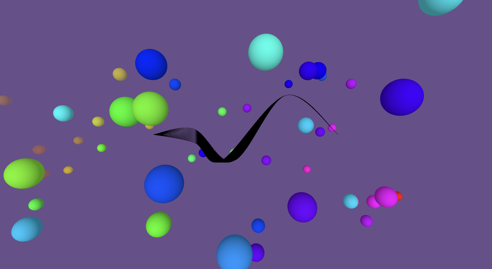

# TBAG Project Short Description - T.Schaeuble



## Brief Outline
With this project, you are given basic control over the movement of a snake through its environment. Pressing and holding any key, incites the snake to glide through a calm and mysterious sea of spheres, the colours of which respond to the accompanying audio track.


## Technical Choices

The scene comprises of three main elements, the snake the spheres and the soundtrack.  
I wanted to create the globes as a class, which would allow me to have more control over how they behaved by enabling their own functions namely update() and move(), as well as how they were drawn into the scene.

For drawing the spheres, I initially used a regular array, but ran into troubles that stemmed from the requirement of an array to have the amount of elements predefined. This created unnecessary constraints.     
To circumnavigate this, @timrumpf suggested that I use an ArrayList, which would enable me to add and remove spheres dynamically within the draw() call. 

The color of the spheres react to the average and smoothed amplitude of all frequences of the FFT analyzer.   
Using HSB colour mode allowed me to map the resultant FFT sum variable to the hue value in a full cycle from 0-360. This meant that the colour changes follow a smooth and continuous gradient of change through the colour spectrum and do not "reset". 

The snakes animation and movement through the scene, as well as music volume is controlled via the ```amp``` variable, which stems from a function I made to increase or decrease dependant on whether a key is held down or not. Using this variable to modulate multiple aspects of the scene, allowed for the entire scene to feel more homogenous. 

The soundtrack was made in Cubase by playing synthesized bells into a plugin called "Primal Tap", which allows you to freeze the delayed audio signal. Once frozen, the audio signal can be pitched up or down, resulting in pitch shift and time stretching / compression. Three different takes are pitched at octave intervals to create tonal separation and therein melodic / harmonic clarity. I knew I wanted the soundtrack to loop, so care was given to space the different layers out in a way that was structurally balanced, no matter where you begun in the loop.


## Artistic Intention

Overall, I wanted the user to feel a sense of calm brought about through the smooth, cyclical movement of the snake, as well as the abstract visual and auditory environment it drifts through.  
The music, with its absense of definitive rhythmic or tonal structure, augments this feeling of calm. Without a rhythm or tonal direction to grasp onto, it becomes hard to uncover hints of a beginning, middle and an end. Absent of this, the experience can become more calming, as it then stands to represent endlessness. 


## Learnings and Reflections

I definitely learned some new technical processes, such as array lists, sound integration and how to use classes properly. But the majority of the learning epxerience was more to do with the semesters learnings both in TBAG and CC being greatly solidified.  
I felt that many difficulties I had with coding became demystified. Even throughout this project itself, the process of having an idea, considering how to implement it with code, trying it, troubleshooting and researching it - to then arriving at functioning code - became smoother and incorperated less steps as time went on.

I was also pleasently surprised how organic the creative process can be when coding. The progression from the initial mountains / valleys idea to the drifting snake, was one of unforced, natural progression through inspiration and happy accidents. Experiencing this natural flow, has helped entice me further into this whole world!

# Video Preview
As a fallback option where streaming does not work via Zoom, here is a [video preview](https://jmp.sh/OPUPcnU) of the sketch.
