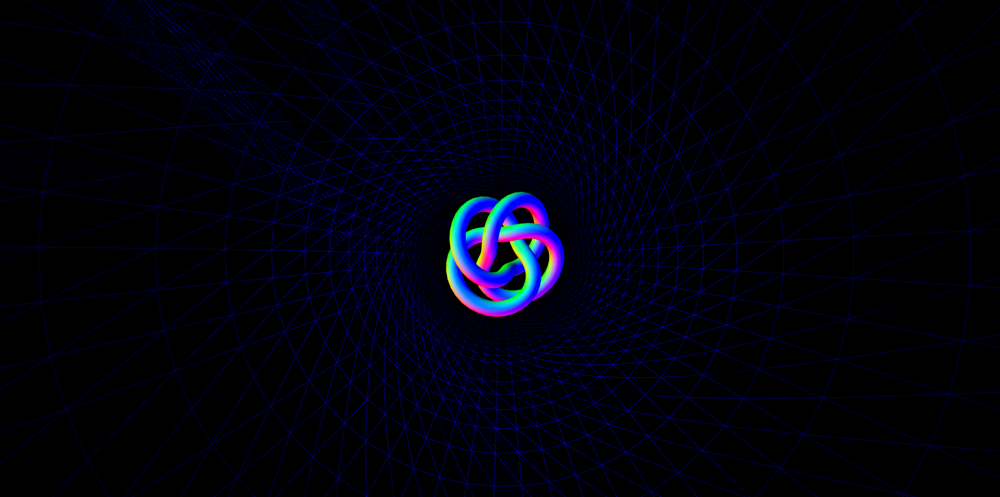
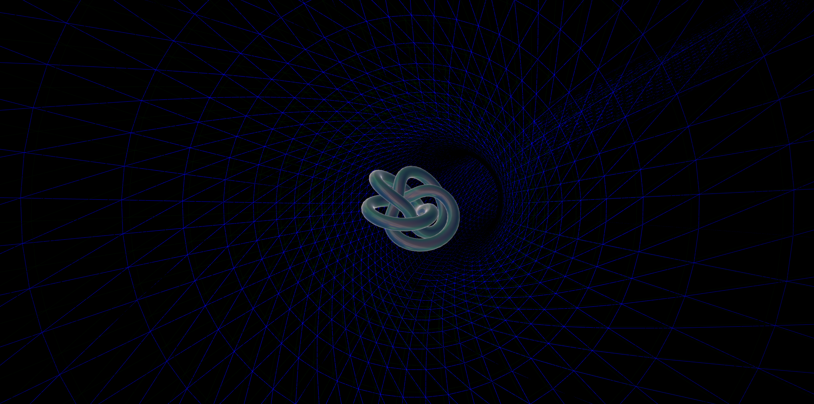
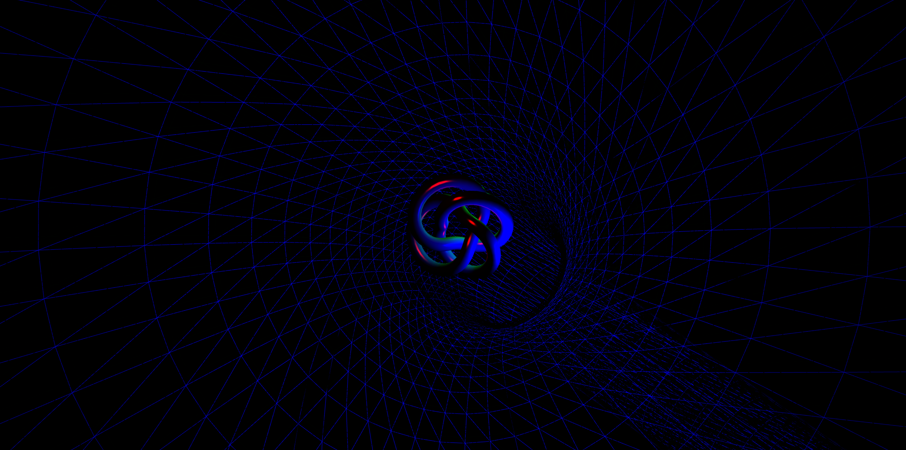

# HEIZKRAFTWERK MOABEAT

  |  
:-------------------------:|:-------------------------:

The background is a tunnel which we traverse. The colour changes are created by mapping light color parameters to 3 different frequency ranges in the music:
low frequencies = blue, middle frequencies = green and high frequencies = red.  
I have also written my own shader which deforms the vertices according to the various frequenceis in the music. The fragment shader reacts to the music by multiplying the normal "brightness" with the bass frequency.  

The video of my final result:  
[YouTube Link to my video](https://youtu.be/YMMXQ9Ge0B0)
 
I have also experimented with other materials / shaders, to make the fragment shader more interesting:

  |  
:-------------------------:|:-------------------------:

Sadly, I wasn't very succesful with combining these tests with my vertex displacement and went with the vertex shader in the end.

## Project Description

*HEIZKRAFTWERK MOABEAT* explores the visuals and soundscapes of inhuman, but man-made, industrial structures.

A core memory that drove me to this topic was when I was biking through Treptower Park & I heard the ungodly noises that were made by the Heizkraftwerk Klingenberg on the other side of the Spree.  
I originally wanted to tape its sounds, but it has since been upgraded to using gas instead of coal, so the sounds are gone...

Luckily (not for nature of course, but for my project), the Heizkraftwerk Moabit still uses coal, so it still sounds just like HKW Klingenberg used to sound!  
So I made a little field trip & recorded various sounds from there with my smartphone.

## Technical Choices: Sound

For the musical piece, my original inspiration was *musique concrete* and I wanted to **only** use recorded sounds in the song.  
In order to enhance my sound palette, I also recorded some sounds from my kitchen, i.e. me kicking my oven or banging metal bowls. I made sure to only use metallic objects for this, so it will sound like machinery.  

However, when I continued working on the project, I always missed rhythm or a beat of some sort. So during the process I started drifting more towards an industrial techno sound, as this was just really fun to work with for me.

## Technical Choices: Graphics

The visual world which is brought to life by the music is supposed to be an abstraction of the many pipes that are used in these industrial structures.  
In the "background" the viewers are sucked into a never-ending pipe, which pulses with light, depending on the sound.  
But the key piece is a torus knot in the centre, which distorts and pulses in sync with the music, almost "dancing".
For the torus knot, I wrote a custom shader material which distorts the vertex position by looking at different "sections" of the frequency spectrum in the music.

## Artistic Vision

My goal was to suck viewers into this abstract world and let them go home when the ride is over. Hence, the intro and outro sections are very important to me, as they serve as intermediaries between the real world and the world of HKW Moabeat.  
The intro is just a plain recording of the Heizkraftwerk and the outro is the same, but mirrored.  
I wanted to highlight that even the nastiest and ugliest structures, like heat/power plants, can have some beautiful, beating hearts within them & encourage my viewers to look for the beauty and rhythms around us, especially in everything we claim as "ugly".  
(And, uh, I still really hope that we can stop burning coal soon...)

## Learnings and Reflections

Whew! All the techniques used in this project I have learned just this semester. So everything, I guess?

I feel like I got more of a grasp now on how web stuff like THREE.js works and where to look if things don't work out.  
I also really enjoyed working with Ableton to create my track, but I think I still *barely* scratched the surface on "how to make music/sounds". I think the same also applies on shader programming: it feels like the more I learn about shaders, the more I am overwhelmed by a vast ocean of possibilities, solutions and crazy stuff one can create with this.

I am looking forward to continue diving into these topics with my future projects.

> **CREDITS:**  
> I have used code snippets and technical approaches by various people. All used sources are referenced (and linked to) in the source code!

